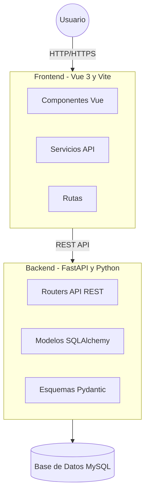
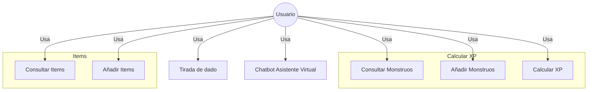

# TFG

Proyecto de TFG para DAM

## Colaboradores

- [Daniel Guirao Coronado](https://github.com/GuiraoDax-Con)
- [Jose Manual Ballesta](https://github.com/jballesta2001)

## Requisitos

- Tener Python 3.12 o superior

    ```python
    python --version
    ```

- Tener Node.js 22.14.0 o superior

    ```javascript
    node --version
    ```

- Tener npm 10.9.2 o superior

    ```javascript
    npm --version
    ```

- Tener javascript

    ```javascript
    npm install -g vite
    ```

## Arquitectura



## Casos de uso



### 🛠️ Backend - La Guarida del Dungeon Master

El backend está desarrollado con FastAPI y Python, proporcionando una API REST robusta y eficiente para gestionar todos los recursos de la aplicación. Su objetivo es ofrecer una lógica de negocio clara, segura y fácilmente ampliable, permitiendo la gestión de monstruos, ítems y otras funcionalidades clave para el juego.

El backend se conecta a una base de datos MySQL mediante SQLAlchemy, y utiliza Pydantic para la validación y serialización de datos. Además, está preparado para ser consumido por cualquier frontend moderno gracias a la configuración de CORS.

El proyecto está organizado en módulos y routers, facilitando la escalabilidad y el mantenimiento del código.

### 🧰 Frontend - La Guarida del Dungeon Master

El frontend está construido con Vue 3 y Vite, lo que hace que la aplicación cargue rápido y sea muy cómoda de desarrollar. La idea es ofrecer una interfaz clara, moderna y que funcione bien en cualquier dispositivo, para que sea fácil gestionar monstruos, ítems y herramientas roleras.

El proyecto está organizado en componentes reutilizables, con servicios que se encargan de comunicarse con la API y estilos modulares para mantener el código ordenado y fácil de ampliar.

A continuación, te explico cómo están distribuidas las carpetas, qué tecnologías se han usado y los puntos clave del desarrollo del frontend.

### 🤖 ChatBot
