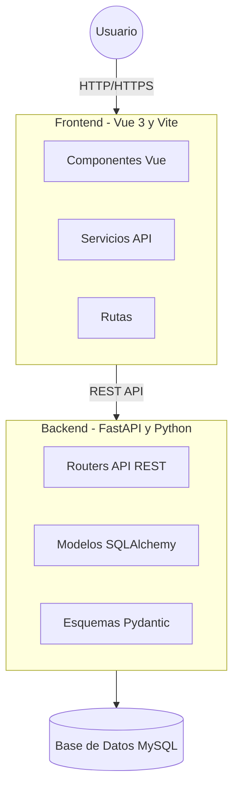
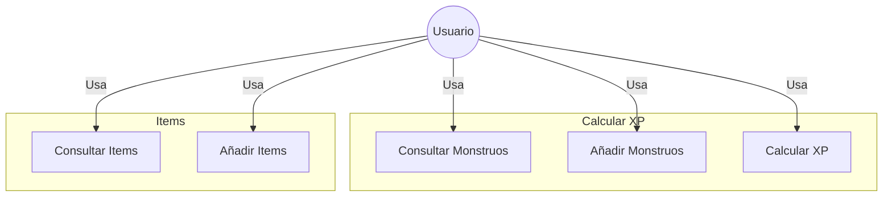

# TFG

Proyecto de TFG para DAM

## Colaboradores

- [Daniel Guirao Coronado](https://github.com/GuiraoDax-Con)
- [Jose Manual](https://github.com/jballesta2001)

## Requisitos

- Tener Python 3.12 o superior

    ```python
    python --version
    ```

- Tener Node.js 22.14.0 o superior

    ```javascript
    node --version
    ```

- Tener npm 10.9.2 o superior

    ```javascript
    npm --version
    ```

- Tener javascript

    ```javascript
    npm install -g vite
    ```

## Arquitectura



## Casos de uso


