# TFG

Proyecto de TFG para DAM

## Colaboradores

- [Daniel Guirao Coronado](https://github.com/GuiraoDax-Con)
- [Jose Manual Ballesta](https://github.com/jballesta2001)

## Requisitos

- Tener Python 3.12 o superior

    ```python
    python --version
    ```

- Tener Node.js 22.14.0 o superior

    ```javascript
    node --version
    ```

- Tener npm 10.9.2 o superior

    ```javascript
    npm --version
    ```

- Tener javascript

    ```javascript
    npm install -g vite
    ```

## Arquitectura


## Casos de uso

```mermaid
flowchart TD
    Usuario((Usuario))
    subgraph Calcular_XP["Calcular XP"]
        CU1[Consultar Monstruos]
        CU2[Añadir Monstruos]
        CU3[Calcular XP]
    end
    subgraph Items["Items"]
        CU4[Consultar Items]
        CU5[Añadir Items]
    end
    CU6[Tirada de dado]
    CU7[Chatbot Asistente Virtual]

    Usuario -- Usa --> CU1
    Usuario -- Usa --> CU2
    Usuario -- Usa --> CU3
    Usuario -- Usa --> CU4
    Usuario -- Usa --> CU5
    Usuario -- Usa --> CU6
    Usuario -- Usa --> CU7
```



### 🧰 Frontend - La Guarida del Dungeon Master

El frontend está construido con Vue 3 y Vite, lo que hace que la aplicación cargue rápido y sea muy cómoda de desarrollar. La idea es ofrecer una interfaz clara, moderna y que funcione bien en cualquier dispositivo, para que sea fácil gestionar monstruos, ítems y herramientas roleras.

El proyecto está organizado en componentes reutilizables, con servicios que se encargan de comunicarse con la API y estilos modulares para mantener el código ordenado y fácil de ampliar.

A continuación, te explico cómo están distribuidas las carpetas, qué tecnologías se han usado y los puntos clave del desarrollo del frontend.
